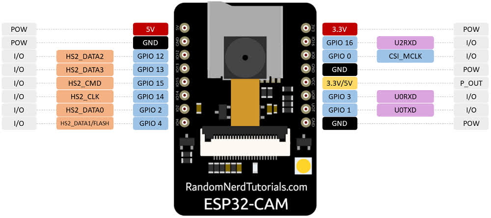

# Como configurar a ESP32-AITHINKER

> Conectar a ESP-32 no PC e instalar o driver [CH341](Driver), caso ainda não tenha.

## Configurações do Arduino IDE

- Adicionar o link `https://dl.espressif.com/dl/package_esp32_index.json` em File > Preferences > Additional Board Manager URLs.

- Instalar a placa "ESP32 by Espressif Systems" em Tools > Board > Boards Manager.

- Selecionar a placa "AI-Thinker ESP32-CAM" e atribuí-la na porta onde a ESP está conectada no PC.

## Descrição de pinos da ESP-32
